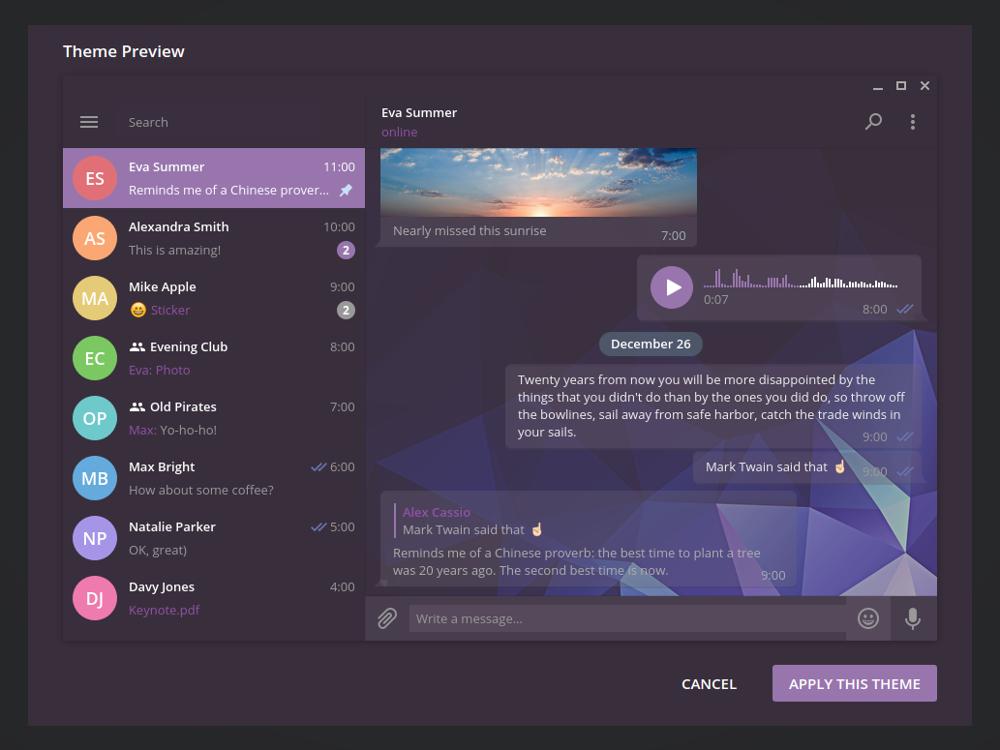

# ponsfrilus' Telegram theme

## A dark Telegram with low-poly background
Based on [@MasterGroosha](https://github.com/MasterGroosha/telegram-soliddark-theme) solid dark theme and using free polygonal low-poly background textures from [@roundedhexagon](http://roundedhexagon.deviantart.com/art/30-Free-Polygonal-Low-Poly-Background-Textures-457811821).

## Screenshot

## Donwload theme
You can download theme here: https://github.com/ponsfrilus/ponsfrilus.tdesktop-theme/raw/master/ponsfrilus.tdesktop-theme

## Notes
* HowTo: http://telegra.ph/Create-Telegram-Theme-01-12
* Solid dark theme: https://github.com/MasterGroosha/telegram-soliddark-theme
* BackGround: http://roundedhexagon.deviantart.com/art/30-Free-Polygonal-Low-Poly-Background-Textures-457811821
